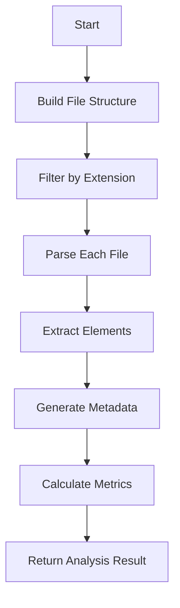

# PROJECT_OVERVIEW.md - Technical Documentation

## Table of Contents
1. [System Architecture](#system-architecture)
2. [Core Components](#core-components)
3. [API Reference](#api-reference)
4. [Configuration Options](#configuration-options)
5. [Error Handling](#error-handling)
6. [Performance Characteristics](#performance-characteristics)
7. [Development Workflow](#development-workflow)
8. [Contribution Guidelines](#contribution-guidelines)

## System Architecture

### High-Level Overview
```
[User Interface] -> [Commands] -> [Documentation Generator] 
    -> [AI Service] -> [DeepSeek R1T2 Chimera API]
    |
    V
[Git Integration] <-> [File System Watcher]
```

### Data Flow
1. User triggers documentation generation via VS Code command
2. System analyzes entire codebase using CodeAnalyzer
3. Generated context is sent to DeepSeek R1T2 Chimera via OpenRouter API
4. AI processes request and returns formatted documentation
5. System writes README.md and PROJECT_OVERVIEW.md to workspace
6. Git integration optionally stages changes and monitors future commits

### Design Patterns
- **Facade Pattern**: DocumentationGenerator provides simplified interface
- **Observer Pattern**: GitCommitIntegration monitors file system changes
- **Strategy Pattern**: Multiple analysis implementations for different file types
- **Singleton Pattern**: SettingsManager handles global configuration

## Core Components

### 1. DocumentationGenerator (`src/services/documentationGenerator.ts`)
Central coordinator for documentation generation process.

```typescript
class DocumentationGenerator {
  async generateAllDocumentation(): Promise<void>
  private analyzeEntireCodebase(workspacePath: string): Promise<string>
  private generateReadme(fullCodebaseAnalysis: string): Promise<string>
  private generateProjectOverview(fullCodebaseAnalysis: string): Promise<string>
  private callDeepSeekAPI(prompt: string): Promise<string>
}
```

### 2. CodeAnalyzer (`src/analyzers/codeAnalyzer.ts`)
Performs static code analysis across multiple languages.

```typescript
class CodeAnalyzer {
  async analyzeProject(
    rootPath: string,
    supportedLanguages: string[],
    excludePatterns: string[]
  ): Promise<AnalysisResult>
  
  private analyzeTypeScriptFile(filePath: string, content: string): AnalysisResult
  private analyzeJavaScriptFile(filePath: string, content: string): AnalysisResult
  private buildFileStructure(rootPath: string, excludePatterns: string[]): Promise<FileNode[]>
}
```

### 3. GitCommitIntegration (`src/services/gitCommitIntegration.ts`)
Handles automatic documentation updates on Git commits.

```typescript
class GitCommitIntegration {
  constructor(generator: DocumentationGenerator)
  private setupCommitHooks(): void
  private handlePostCommit(workspaceRoot: string): Promise<void>
  async manuallyTriggerUpdate(): Promise<void>
}
```

### 4. DeepSeekClient (`src/services/deepSeekClient.ts`)
Wrapper for DeepSeek R1T2 Chimera API interactions.

```typescript
class DeepSeekClient {
  async generateDocumentation(prompt: string, codeContext: string): Promise<string>
  async testConnection(): Promise<boolean>
  getReadmePrompt(): string
  getTechnicalOverviewPrompt(): string
}
```

## API Reference

### CodeAnalyzer Methods

#### `analyzeProject()`
```typescript
async analyzeProject(
  rootPath: string,
  supportedLanguages: string[],
  excludePatterns: string[]
): Promise<AnalysisResult>
```
**Parameters:**
- `rootPath`: Absolute path to workspace root
- `supportedLanguages`: Array of language identifiers (e.g., ['typescript', 'python'])
- `excludePatterns`: Glob patterns to exclude from analysis

**Returns:**
```typescript
interface AnalysisResult {
  elements: CodeElement[];
  dependencies: string[];
  fileStructure: FileNode[];
  metrics: {
    linesOfCode: number;
    complexity: number;
  };
  metadata?: {
    projectName?: string;
    version?: string;
    description?: string;
  };
}
```

### DocumentationGenerator Methods

#### `generateAllDocumentation()`
```typescript
async generateAllDocumentation(): Promise<void>
```
**Workflow:**
1. Validates API token configuration
2. Shows progress notification in VS Code
3. Performs full codebase analysis
4. Generates both README.md and PROJECT_OVERVIEW.md
5. Writes files to workspace root

### GitCommitIntegration Methods

#### `handlePostCommit()`
```typescript
private async handlePostCommit(workspaceRoot: string): Promise<void>
```
**Logic Flow:**
1. Checks if auto-update is enabled
2. Determines if documentation needs updating
3. Shows progress notification
4. Generates new documentation
5. Stages updated files in Git

## Configuration Options

### SettingsManager (`src/utils/settingsManager.ts`)
**Persistent Configuration Values:**

| Key | Type | Default | Description |
|-----|------|---------|-------------|
| `apiToken` | string | - | DeepSeek API token (starts with "sk-") |
| `autoUpdateOnCommit` | boolean | false | Enable automatic updates on Git commit |
| `excludePatterns` | string[] | [...] | File patterns to exclude from analysis |
| `ai.defaultModel` | string | "tngtech/deepseek-r1t2-chimera:free" | Default AI model |
| `ai.maxTokens` | number | 8192 | Maximum tokens per AI request |
| `ai.temperature` | number | 0.1 | AI creativity level (0-2) |

**Example Configuration:**
```json
{
  "ai-doc-generator.apiToken": "sk-...",
  "ai-doc-generator.autoUpdateOnCommit": true,
  "ai-doc-generator.excludePatterns": [
    "node_modules/**",
    "dist/**",
    "**/*.test.*"
  ]
}
```

## Error Handling

### Error Types and Recovery

| Error Scenario | Handling Mechanism | User Notification |
|----------------|---------------------|-------------------|
| Missing API Token | Exception thrown with guidance | Configuration prompt with "Set API Token" option |
| API Request Failure | Retry logic (3 attempts) | Detailed error message with status code |
| File Analysis Failure | Skip problematic files | Warning in output channel |
| Git Integration Failure | Fallback to manual mode | Status bar notification with troubleshooting link |
| Rate Limiting | Exponential backoff | "API Limit Exceeded" notification with timer |

### Troubleshooting Guide

1. **Documentation Generation Fails**
   - Verify API token validity
   - Check network connectivity to OpenRouter API
   - Review output channel for detailed errors

2. **Git Auto-Update Not Working**
   - Ensure `.git` directory exists in workspace
   - Verify extension has file system permissions
   - Check `autoUpdateOnCommit` setting is enabled

3. **Incomplete Code Analysis**
   - Review exclude patterns in settings
   - Check for large binary files in workspace
   - Verify supported languages configuration

## Performance Characteristics

### Resource Utilization
- **Memory Usage**: ~200MB baseline, peaks at ~500MB during analysis
- **CPU Utilization**: Intensive during code parsing (TypeScript analysis)
- **Network**: ~5MB per request to DeepSeek API

### Optimization Strategies
1. **Incremental Analysis**: Only processes changed files after initial run
2. **Debounced Updates**: 1.5s delay on Git watcher events
3. **Selective Processing**: Skips binary and excluded files
4. **Parallel Processing**: File analysis uses async concurrency

### Limitations
- Large monorepos (>10k files) may require increased memory
- Complex TypeScript generics may not be fully analyzed
- Python analysis limited to function/class declarations (no full AST parsing)

## Development Workflow

### Key Algorithms

#### Code Analysis Workflow


#### Git Integration Logic
```typescript
// Simplified commit handling logic
function handleGitCommit() {
  const changes = getChangedFiles();
  if (changes.some(isCodeFile)) {
    generateDocumentation();
    if (config.autoStage) {
      stageDocumentationFiles();
    }
  }
}
```

### Data Structures

#### CodeElement Interface
```typescript
interface CodeElement {
  type: 'function' | 'class' | 'interface' | 'variable' | 'type' | 'enum' | 'module';
  name: string;
  description?: string;
  parameters?: Parameter[];
  returnType?: string;
  visibility: 'public' | 'private' | 'protected';
  location: {
    file: string;
    line: number;
    column: number;
  };
  // ...additional properties
}
```

## Contribution Guidelines

### Technical Specifications

#### Prerequisites
- Node.js v18+
- VS Code Extension Development Setup
- DeepSeek R1T2 Chimera API Token

#### Development Setup
```bash
git clone https://github.com/your-repo/doc-generator-extension.git
cd doc-generator-extension
npm install
npm run compile
```

### Testing Procedures
1. **Unit Tests**: `npm test`
2. **Integration Tests**:
   - Manual verification of documentation generation
   - Git commit simulation testing
3. **Performance Testing**:
   - Test with large codebases (>1000 files)
   - Monitor memory usage during analysis

### Code Standards
- TypeScript strict mode enabled
- ESLint with Airbnb base configuration
- JSDoc comments for all public methods
- 80% test coverage minimum

### Extension Packaging
```bash
npm install -g vsce
vsce package
```

### Release Checklist
1. Update version in `package.json`
2. Verify all tests pass
3. Update CHANGELOG.md
4. Create signed VSIX package
5. Publish to VS Code Marketplace

## Example Usage

### Generating Documentation Programmatically
```typescript
const generator = new DocumentationGenerator();
await generator.generateAllDocumentation();
```

### Manual Git Integration Trigger
```typescript
const gitIntegration = new GitCommitIntegration(generator);
await gitIntegration.manuallyTriggerUpdate();
```

### Custom Analysis Configuration
```typescript
const analyzer = new CodeAnalyzer();
const result = await analyzer.analyzeProject(
  '/path/to/project',
  ['typescript', 'python'],
  ['**/test/**', '**/mock/**']
);
```