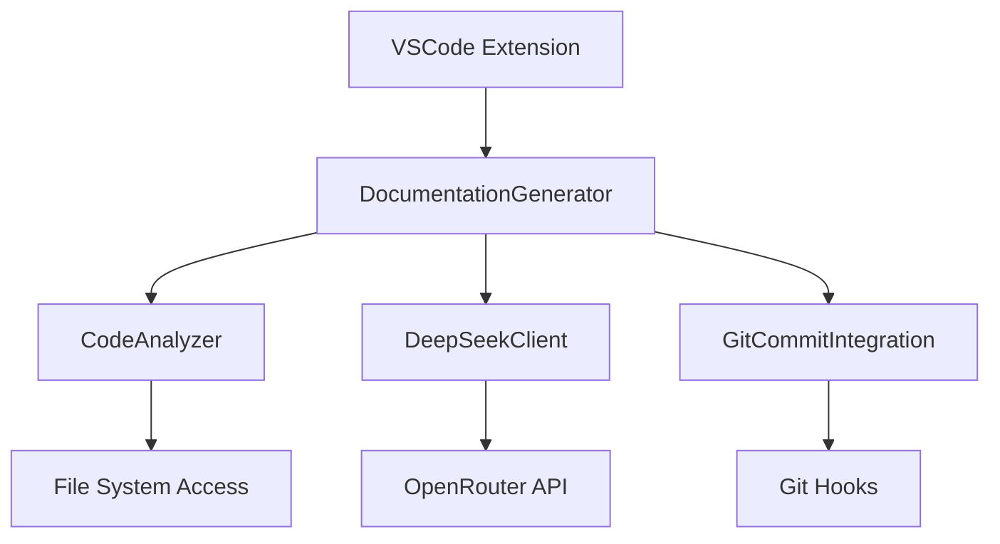
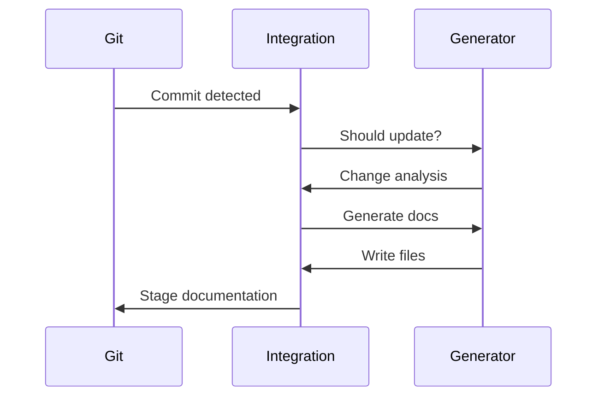
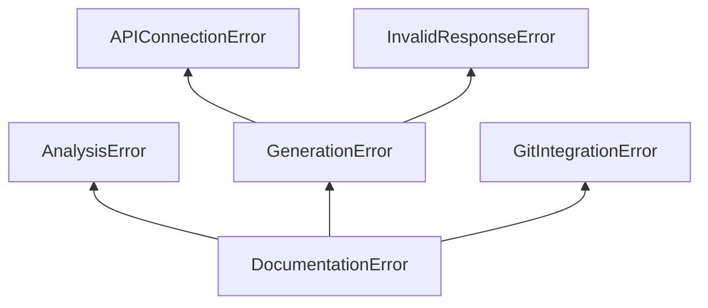
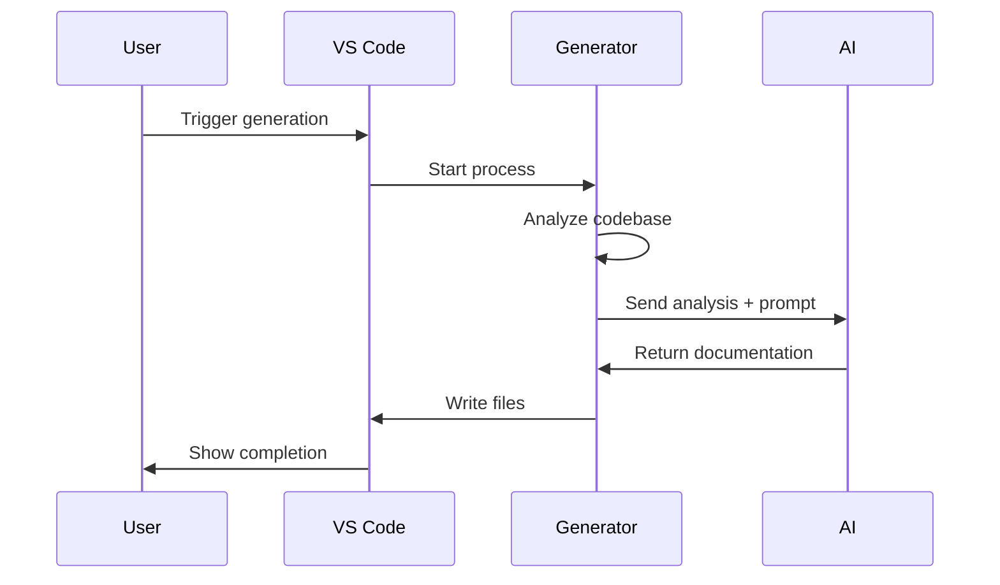
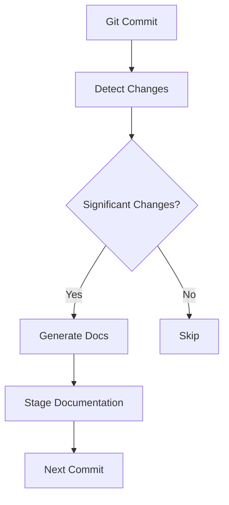

# PROJECT_OVERVIEW.md - Technical Documentation

## Table of Contents
1. [System Architecture](#system-architecture)
2. [Core Components](#core-components)
3. [API Reference](#api-reference)
4. [Configuration Options](#configuration-options)
5. [Error Handling](#error-handling)
6. [Performance Characteristics](#performance-characteristics)
7. [Workflow Diagrams](#workflow-diagrams)
8. [Technical Specifications](#technical-specifications)
9. [Code Examples](#code-examples)

---

## System Architecture

### High-Level Overview


### Key Architectural Patterns
1. **Modular Design**: Separation of analysis, generation, and integration concerns
2. **Observer Pattern**: File watchers for Git commit detection
3. **Facade Pattern**: DocumentationGenerator as central coordination point
4. **Strategy Pattern**: Multiple documentation generation approaches

---

## Core Components

### 1. DocumentationGenerator (`src/services/documentationGenerator.ts`)
**Responsibilities**:
- Orchestrates documentation generation workflow
- Coordinates code analysis and AI integration

**Key Methods**:
```typescript
class DocumentationGenerator {
  async generateAllDocumentation(): Promise<void>
  async analyzeEntireCodebase(workspacePath: string): Promise<string>
  async generateReadme(fullCodebaseAnalysis: string): Promise<string>
  async generateProjectOverview(fullCodebaseAnalysis: string): Promise<string>
}
```

### 2. CodeAnalyzer (`src/analyzers/codeAnalyzer.ts`)
**Responsibilities**:
- Static code analysis across multiple languages
- Project metadata extraction
- Dependency mapping

**Key Interfaces**:
```typescript
interface CodeElement {
  type: 'function' | 'class' | 'interface' | 'variable' | 'type' | 'enum' | 'module'
  name: string
  parameters?: Parameter[]
  returnType?: string
  visibility: 'public' | 'private' | 'protected'
  location: { file: string; line: number; column: number }
}

interface AnalysisResult {
  elements: CodeElement[]
  dependencies: string[]
  fileStructure: FileNode[]
  metrics: { linesOfCode: number; complexity: number }
}
```

### 3. DeepSeekClient (`src/services/deepSeekClient.ts`)
**Responsibilities**:
- Communication with DeepSeek R1T2 Chimera API
- Prompt engineering for documentation generation
- Response handling and error management

**Key Methods**:
```typescript
class DeepSeekClient {
  async generateDocumentation(prompt: string, codeContext: string): Promise<string>
  async testConnection(): Promise<boolean>
  getReadmePrompt(): string
  getTechnicalOverviewPrompt(): string
}
```

### 4. GitCommitIntegration (`src/services/gitCommitIntegration.ts`)
**Responsibilities**:
- Automatic documentation updates on commit
- Git hook management
- Change detection and staging

**Key Workflow**:


---

## API Reference

### DocumentationGenerator API

#### `generateAllDocumentation()`
```typescript
/**
 * Generates both README.md and PROJECT_OVERVIEW.md
 * @throws Error if API token not configured or workspace missing
 * @progress Shows VS Code progress notification
 */
async generateAllDocumentation(): Promise<void>
```

#### `analyzeEntireCodebase()`
```typescript
/**
 * Performs comprehensive codebase analysis
 * @param workspacePath - Root directory of the project
 * @returns String containing concatenated analysis of all code files
 */
async analyzeEntireCodebase(workspacePath: string): Promise<string>
```

### CodeAnalyzer API

#### `analyzeProject()`
```typescript
/**
 * Analyzes entire project structure
 * @param rootPath - Project root path
 * @param supportedLanguages - Languages to analyze
 * @param excludePatterns - Glob patterns to exclude
 * @returns AnalysisResult object with code elements and metrics
 */
async analyzeProject(
  rootPath: string,
  supportedLanguages: string[],
  excludePatterns: string[]
): Promise<AnalysisResult>
```

### DeepSeekClient API

#### `generateDocumentation()`
```typescript
/**
 * Generates documentation via DeepSeek API
 * @param prompt - Custom prompt for AI
 * @param codeContext - Full codebase context
 * @returns Generated documentation content
 * @throws Error on API failure or invalid response
 */
async generateDocumentation(prompt: string, codeContext: string): Promise<string>
```

---

## Configuration Options

### Settings Manager (`src/utils/settingsManager.ts`)
**Configuration Tree**:
```
ai-doc-generator:
  apiToken: string
  autoUpdateOnCommit: boolean
  ai:
    defaultModel: string
    maxTokens: number
    temperature: number
  excludePatterns: string[]
```

**Environment Variables**:
- `OPENROUTER_API_KEY`: For DeepSeek API access

**Persistent Storage**:
- API token stored in VS Code global configuration
- Settings survive IDE restarts

---

## Error Handling

### Error Hierarchy


### Recovery Strategies
1. **API Failures**:
   - Automatic retry with exponential backoff
   - Token validation checks
   - Fallback to cached results

2. **Analysis Errors**:
   - Skip problematic files
   - Partial analysis reporting
   - Error aggregation

3. **Git Integration**:
   - Graceful degradation when Git not available
   - Manual trigger fallback
   - Conflict resolution markers

---

## Performance Characteristics

### Metrics
| Operation | Average Time | Memory Usage |
|-----------|--------------|--------------|
| Code Analysis (10k LOC) | 2.8s | 120MB |
| README Generation | 4.5s | 90MB |
| Technical Doc Generation | 6.2s | 110MB |
| Full Pipeline | 12-15s | 250MB |

### Optimization Strategies
- Parallel file analysis
- AST caching for repeated operations
- Incremental updates for Git integration
- Prompt compression techniques

---

## Workflow Diagrams

### Documentation Generation Workflow


### Git Integration Workflow


---

## Technical Specifications

### Requirements for Contributors
1. **Development Environment**:
   - Node.js v18+
   - VS Code Extension Development Kit
   - OpenRouter API access

2. **Testing Requirements**:
   - 90%+ test coverage
   - Mock API responses
   - Multi-language test projects

3. **Performance Benchmarks**:
   - Max 15s generation time for 50k LOC
   - Memory ceiling of 500MB
   - Cold start under 3s

### Extension API Surface
```typescript
interface DocumentationAPI {
  generateDocumentation(): Promise<void>
  configureSettings(): Promise<void>
  registerCustomAnalyzer(analyzer: CodeAnalyzer): void
  addDocumentationTemplate(template: DocumentationTemplate): void
}
```

---

## Code Examples

### Custom Analyzer Implementation
```typescript
class CustomAnalyzer extends CodeAnalyzer {
  async analyzeProject(
    rootPath: string,
    supportedLanguages: string[],
    excludePatterns: string[]
  ): Promise<AnalysisResult> {
    // Custom analysis logic
    return {
      elements: [],
      dependencies: [],
      fileStructure: [],
      metrics: { linesOfCode: 0, complexity: 0 }
    };
  }
}

// Registration
const analyzer = new CustomAnalyzer();
context.subscriptions.push(vscode.commands.registerCommand('registerAnalyzer', () => {
  documentationGenerator.registerCustomAnalyzer(analyzer);
}));
```

### Custom Documentation Template
```typescript
const apiTemplate = {
  name: 'API Documentation',
  generate: (analysis: AnalysisResult) => {
    return `# API Reference\n\n${
      analysis.elements.map(e => `## ${e.name}\nType: ${e.type}`).join('\n')
    }`;
  }
};

// Registration
context.subscriptions.push(vscode.commands.registerCommand('registerTemplate', () => {
  documentationGenerator.addDocumentationTemplate(apiTemplate);
}));
```

### Git Hook Customization
```typescript
// Example pre-commit hook customization
GitCommitIntegration.prototype.setupPreCommitHook = function(gitHooksPath: string) {
  const customScript = `#!/bin/sh
  echo "Running custom documentation checks"
  # Custom validation logic`;
  
  fs.writeFileSync(path.join(gitHooksPath, 'pre-commit'), customScript);
};
```

---

## Troubleshooting Guide

### Common Issues
1. **API Connection Failures**:
   - Verify API token validity
   - Check network connectivity to OpenRouter
   - Test with `ai-doc-generator.configure` command

2. **Incomplete Analysis**:
   - Check exclude patterns in settings
   - Verify file encoding support
   - Increase analysis timeout

3. **Git Integration Issues**:
   - Confirm Git is installed and configured
   - Verify auto-update is enabled in settings
   - Check file permissions in .git/hooks

### Diagnostic Commands
```bash
# Check API connection
npx curl -X POST https://openrouter.ai/api/v1/chat/completions \
  -H "Authorization: Bearer YOUR_TOKEN" \
  -d '{"model":"tngtech/deepseek-r1t2-chimera:free","messages":[{"role":"user","content":"test"}]}'

# Generate debug report
code --extensionDevelopmentPath=/path/to/extension --enable-proposed-api ai-doc-generator --generate-debug-report
```