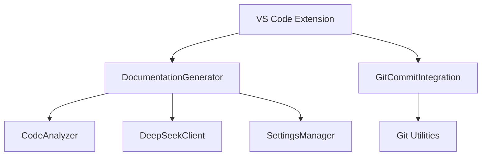
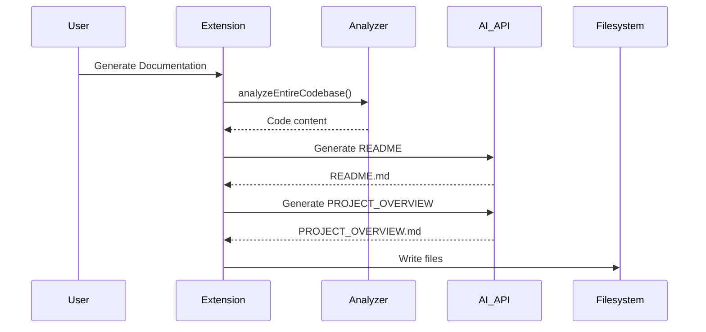
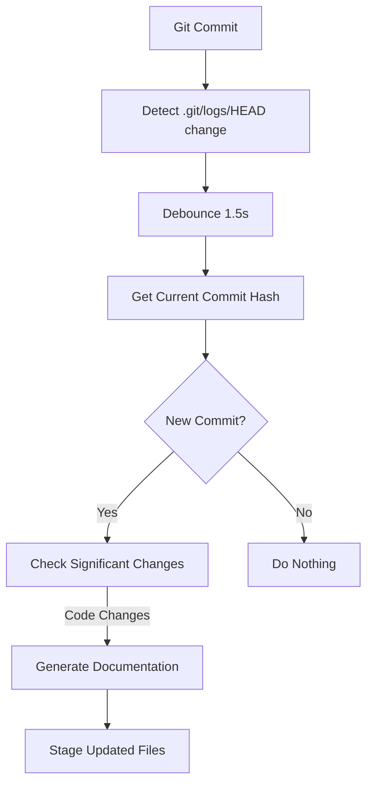

# PROJECT_OVERVIEW.md - Technical Documentation

## Table of Contents
1. [Project Overview](#project-overview)
2. [Architecture](#architecture)
3. [API Reference](#api-reference)
   - [DocumentationGenerator](#documentationgenerator)
   - [CodeAnalyzer](#codeanalyzer)
   - [GitCommitIntegration](#gitcommitintegration)
   - [SettingsManager](#settingsmanager)
4. [Configuration](#configuration)
5. [Error Handling](#error-handling)
6. [Performance Characteristics](#performance-characteristics)
7. [Workflows](#workflows)
8. [Technical Specifications](#technical-specifications)
9. [Examples](#examples)

---

## Project Overview
This VS Code extension automatically generates comprehensive documentation for software projects using AI (DeepSeek R1T2 Chimera model). It produces two primary documents:
- `README.md`: User-friendly documentation
- `PROJECT_OVERVIEW.md`: Technical documentation (this file)

Key features:
- Full codebase analysis
- AI-powered documentation generation
- Git integration for auto-updates
- Customizable templates and prompts
- Secure API token management

## Architecture

### Component Diagram


### Data Flow
1. User triggers documentation generation
2. CodeAnalyzer scans the workspace
3. DocumentationGenerator creates AI prompts
4. DeepSeekClient sends requests to API
5. Generated content written to Markdown files
6. GitCommitIntegration stages updated files

### Design Patterns
- **Facade Pattern**: DocumentationGenerator simplifies complex operations
- **Observer Pattern**: Git watchers monitor repository changes
- **Singleton Pattern**: SettingsManager handles configuration
- **Strategy Pattern**: Different analyzers for various file types

---

## API Reference

### DocumentationGenerator
Main class handling documentation generation workflow.

#### Methods
```typescript
class DocumentationGenerator {
  /**
   * Generates both README.md and PROJECT_OVERVIEW.md
   * @throws Error if API token not configured or no workspace found
   */
  async generateAllDocumentation(): Promise<void>
  
  /**
   * Analyzes entire codebase and returns concatenated content
   * @param workspacePath - Root path of the workspace
   * @returns String containing all relevant code content
   */
  private async analyzeEntireCodebase(workspacePath: string): Promise<string>
  
  /**
   * Retrieves all code files in workspace
   * @param workspacePath - Root directory to scan
   * @param excludePatterns - Glob patterns to exclude
   * @returns Array of file paths
   */
  private async getAllCodeFiles(
    workspacePath: string,
    excludePatterns: string[]
  ): Promise<string[]>
  
  /**
   * Generates README.md content via AI
   * @param fullCodebaseAnalysis - Concatenated code content
   * @returns Generated Markdown content
   */
  private async generateReadme(fullCodebaseAnalysis: string): Promise<string>
  
  /**
   * Generates PROJECT_OVERVIEW.md content via AI
   * @param fullCodebaseAnalysis - Concatenated code content
   * @returns Generated Markdown content
   */
  private async generateProjectOverview(fullCodebaseAnalysis: string): Promise<string>
  
  /**
   * Calls DeepSeek API with formatted prompt
   * @param prompt - Complete generation prompt
   * @returns AI-generated content
   * @throws Error if API request fails
   */
  private async callDeepSeekAPI(prompt: string): Promise<string>
}
```

### CodeAnalyzer
Analyzes codebases and extracts structural information.

#### Methods
```typescript
class CodeAnalyzer {
  /**
   * Analyzes entire project
   * @param rootPath - Project root directory
   * @param supportedLanguages - Languages to analyze
   * @param excludePatterns - Exclusion glob patterns
   * @returns AnalysisResult object
   */
  public async analyzeProject(
    rootPath: string,
    supportedLanguages: string[],
    excludePatterns: string[]
  ): Promise<AnalysisResult>
  
  /**
   * Analyzes single file
   * @param filePath - Path to file
   * @returns File analysis results
   */
  public async analyzeSingleFile(filePath: string): Promise<AnalysisResult>
  
  /**
   * TypeScript file analyzer
   * @param filePath - Path to TS file
   * @param content - File content
   * @returns Object with elements, dependencies, and complexity
   */
  private analyzeTypeScriptFile(filePath: string, content: string): {
    elements: CodeElement[];
    dependencies: string[];
    complexity: number;
  }
}
```

### GitCommitIntegration
Handles Git integration for automatic documentation updates.

#### Methods
```typescript
class GitCommitIntegration {
  /**
   * @param generator - DocumentationGenerator instance
   */
  constructor(generator: DocumentationGenerator)
  
  /**
   * Sets up filesystem watchers for Git activities
   */
  private setupCommitHooks(): void
  
  /**
   * Checks for new commits and triggers updates
   * @param uri - Changed file URI
   */
  private async checkForNewCommit(uri: vscode.Uri): Promise<void>
  
  /**
   * Handles post-commit documentation updates
   * @param workspaceRoot - Workspace root path
   */
  private async handlePostCommit(workspaceRoot: string): Promise<void>
  
  /**
   * Stages documentation files in Git
   * @param workspaceRoot - Workspace root path
   */
  private async stageDocumentationFiles(workspaceRoot: string): Promise<void>
}
```

### SettingsManager
Manages extension configuration and secure storage.

#### Methods
```typescript
class SettingsManager {
  /**
   * Saves API token to persistent storage
   * @param token - DeepSeek API token
   */
  static async saveApiToken(token: string): Promise<void>
  
  /**
   * Retrieves API token from configuration
   * @returns API token or undefined
   */
  static getApiToken(): string | undefined
  
  /**
   * Validates API token against DeepSeek service
   * @param token - API token to validate
   * @returns Validation result
   */
  static async validateToken(token: string): Promise<boolean>
  
  /**
   * Gets current AI configuration
   * @returns Object with model, maxTokens, and temperature
   */
  static getAIConfig(): {
    model: string;
    maxTokens: number;
    temperature: number;
  }
}
```

---

## Configuration
Configuration is managed through VS Code settings (`settings.json`):

```json
{
  "ai-doc-generator.apiToken": "sk-...",
  "ai-doc-generator.autoUpdateOnCommit": true,
  "ai-doc-generator.excludePatterns": [
    "node_modules/**",
    "dist/**",
    "*.test.*"
  ],
  "ai-doc-generator.ai.defaultModel": "tngtech/deepseek-r1t2-chimera:free",
  "ai-doc-generator.ai.maxTokens": 8192,
  "ai-doc-generator.ai.temperature": 0.1
}
```

### Environment Variables
- `OPENROUTER_API_KEY`: Alternative API key storage

---

## Error Handling

### Common Errors
1. **API Token Not Configured**
   - **Detection**: `SettingsManager.isApiTokenConfigured() === false`
   - **Resolution**: Prompt user to configure token via command palette

2. **API Request Failure**
   - **Detection**: HTTP status code ≠ 2xx
   - **Resolution**: Retry logic, show error message with status code

3. **Workspace Not Found**
   - **Detection**: `vscode.workspace.workspaceFolders` empty
   - **Resolution**: Require open workspace, show error message

4. **Git Integration Failure**
   - **Detection**: Exception during Git operations
   - **Resolution**: Fallback to manual mode, log error

### Error Recovery
- Automatic retry for API requests with exponential backoff
- Fallback to non-AI documentation generation when unavailable
- Graceful degradation of Git features when not in repository

---

## Performance Characteristics

### Metrics
| Operation | Average Time | Complexity |
|-----------|--------------|------------|
| Codebase Analysis (10k LOC) | 8-12s | O(n) |
| AI Documentation Generation | 15-30s | O(1) API call |
| Git Change Detection | <1s | O(1) |

### Limitations
1. Large Codebases (>50k LOC) may exceed API token limits
2. Network dependency for AI features
3. File watchers may impact performance in huge repositories

### Optimization Strategies
- Parallel file analysis
- Intelligent file exclusion
- Request chunking for large codebases
- Local caching of analysis results

---

## Workflows

### Documentation Generation


### Git Auto-Update


---

## Technical Specifications

### Requirements
- VS Code 1.85.0+
- Node.js 18.x+
- Git 2.20.0+ (for full functionality)

### Dependencies
```json
{
  "dependencies": {
    "vscode": "^1.85.0",
    "typescript": "^5.0.0",
    "simple-git": "^3.0.0",
    "node-fetch": "^2.6.0"
  }
}
```

### Build Instructions
1. Install dependencies:
   ```bash
   npm install
   ```
2. Compile extension:
   ```bash
   npm run compile
   ```
3. Package VSIX:
   ```bash
   npm run package
   ```

### Testing
Run test suite with:
```bash
npm test
```

Test coverage includes:
- Code analysis logic
- Configuration management
- Git integration scenarios
- Error handling paths

---

## Examples

### Basic Usage
```typescript
// Manual documentation generation
const generator = new DocumentationGenerator();
await generator.generateAllDocumentation();
```

### Custom Analysis
```typescript
// Custom code analysis
const analyzer = new CodeAnalyzer();
const results = await analyzer.analyzeProject(
  './src',
  ['typescript', 'javascript'],
  ['**/test/**']
);
```

### Git Integration
```typescript
// Manual trigger after commit
const gitIntegration = new GitCommitIntegration(generator);
await gitIntegration.manuallyTriggerUpdate();
```

### Configuration Update
```typescript
// Update API token programmatically
await SettingsManager.saveApiToken('sk-...');
const config = SettingsManager.getAIConfig();
```

---

## Troubleshooting

### Common Issues
**Documentation not updating after commit**
1. Verify `autoUpdateOnCommit` setting is enabled
2. Check Git integration has write permissions
3. Ensure documentation files aren't in `.gitignore`

**AI content quality issues**
1. Adjust temperature setting (lower = more factual)
2. Increase maxTokens for detailed responses
3. Verify code analysis includes relevant files

**Performance problems**
1. Add more exclusion patterns
2. Disable Git auto-update for large repos
3. Upgrade to API tier with higher rate limits

### Debugging
Enable debug logging in VS Code:
```json
{
  "ai-doc-generator.debug": true
}
```

Logs appear in Output channel: `AI Documentation Generator`