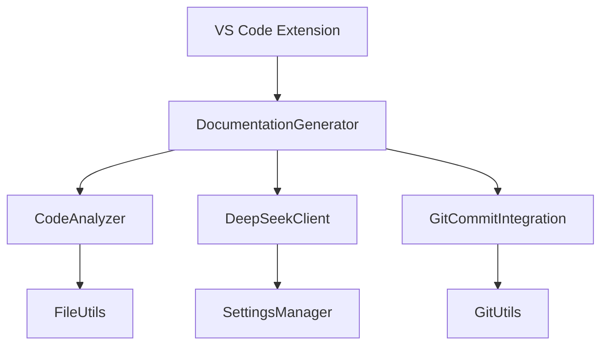
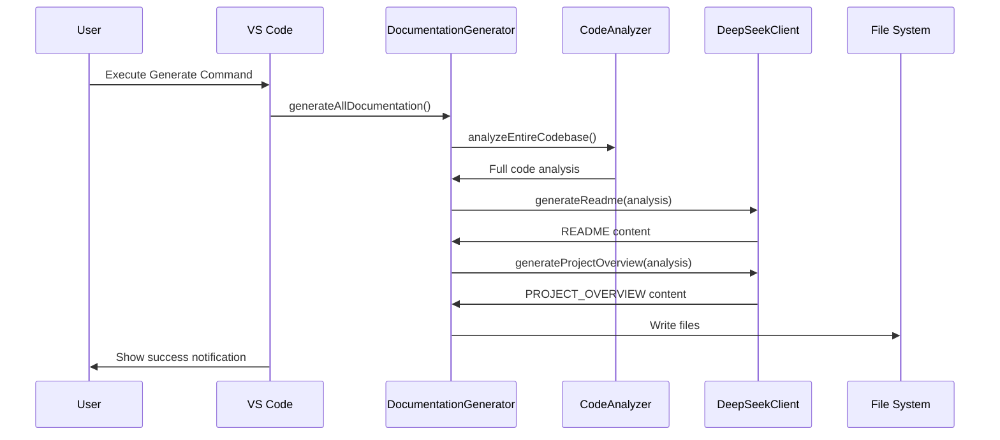
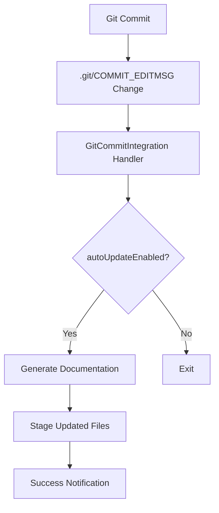

# PROJECT_OVERVIEW.md - Technical Documentation

## Table of Contents
1. [System Architecture](#system-architecture)
2. [Core Components](#core-components)
3. [API Reference](#api-reference)
4. [Configuration Options](#configuration-options)
5. [Workflows & Data Flow](#workflows--data-flow)
6. [Error Handling](#error-handling)
7. [Performance Characteristics](#performance-characteristics)
8. [Technical Specifications](#technical-specifications)
9. [Code Examples](#code-examples)

---

## System Architecture

### Component Diagram


### Architecture Overview
The system follows a modular architecture with these layers:
1. **Presentation Layer**: VS Code command interface and status bar
2. **Application Layer**: 
   - `DocumentationGenerator` (orchestrator)
   - `CodeAnalyzer` (codebase processing)
3. **Service Layer**:
   - `DeepSeekClient` (AI API communication)
   - `GitCommitIntegration` (version control hooks)
4. **Utility Layer**:
   - `SettingsManager` (persistent configuration)
   - `FileUtils` (filesystem operations)
   - `GitUtils` (Git operations)

---

## Core Components

### 1. DocumentationGenerator (`src/services/documentationGenerator.ts`)
**Responsibilities**:
- Coordinates documentation generation workflow
- Manages progress reporting
- Integrates code analysis with AI processing

**Key Methods**:
```typescript
class DocumentationGenerator {
    async generateAllDocumentation(): Promise<void>
    async analyzeEntireCodebase(workspacePath: string): Promise<string>
    async generateReadme(fullCodebaseAnalysis: string): Promise<string>
    async generateProjectOverview(fullCodebaseAnalysis: string): Promise<string>
    async callDeepSeekAPI(prompt: string): Promise<string>
}
```

### 2. CodeAnalyzer (`src/analyzers/codeAnalyzer.ts`)
**Responsibilities**:
- Recursive codebase scanning
- Language-specific source code analysis
- Metadata extraction

**Key Methods**:
```typescript
class CodeAnalyzer {
    async analyzeProject(rootPath: string, supportedLanguages: string[], excludePatterns: string[]): Promise<AnalysisResult>
    async analyzeSingleFile(filePath: string): Promise<AnalysisResult>
    private analyzeTypeScriptFile(filePath: string, content: string): { elements: CodeElement[], dependencies: string[], complexity: number }
    private shouldExclude(filePath: string, excludePatterns: string[]): boolean
}
```

### 3. DeepSeekClient (`src/services/deepSeekClient.ts`)
**Responsibilities**:
- API communication with DeepSeek R1T2 Chimera
- Prompt templating
- Response handling

**Key Methods**:
```typescript
class DeepSeekClient {
    async generateDocumentation(prompt: string, codeContext: string): Promise<string>
    async testConnection(): Promise<boolean>
    getReadmePrompt(): string
    getTechnicalOverviewPrompt(): string
}
```

### 4. GitCommitIntegration (`src/services/gitCommitIntegration.ts`)
**Responsibilities**:
- Post-commit documentation updates
- Automatic staging of generated files
- Git hook management

**Key Methods**:
```typescript
class GitCommitIntegration {
    private setupCommitHooks(): void
    async handlePostCommit(): Promise<void>
    async stageDocumentationFiles(): Promise<void>
}
```

---

## API Reference

### CodeAnalyzer API
#### `analyzeProject()`
```typescript
interface AnalysisResult {
    elements: CodeElement[];
    dependencies: string[];
    fileStructure: FileNode[];
    metrics: {
        linesOfCode: number;
        complexity: number;
    };
    metadata?: {
        fileName?: string;
        projectName?: string;
        version?: string;
        description?: string;
    };
}

async analyzeProject(
    rootPath: string,
    supportedLanguages: string[],
    excludePatterns: string[]
): Promise<AnalysisResult>
```

**Parameters**:
- `rootPath`: Absolute path to workspace root
- `supportedLanguages`: Array of language identifiers (['typescript', 'javascript'])
- `excludePatterns`: Glob patterns for file exclusion

**Returns**: Structured analysis of codebase

### DeepSeekClient API
#### `generateDocumentation()`
```typescript
async generateDocumentation(
    prompt: string, 
    codeContext: string
): Promise<string>
```

**Parameters**:
- `prompt`: Pre-formatted documentation template
- `codeContext`: Full codebase analysis string

**Returns**: Generated documentation in markdown format

---

## Configuration Options

### SettingsManager (`src/utils/settingsManager.ts`)
**Configuration Schema**:
```typescript
interface AIConfig {
    model: string;          // Default: 'tngtech/deepseek-r1t2-chimera:free'
    maxTokens: number;      // Default: 8192
    temperature: number;    // Default: 0.1
}

interface ExtensionConfig {
    apiToken?: string;
    autoUpdateOnCommit: boolean;
    excludePatterns: string[];
    ai: AIConfig;
}
```

**Environment Variables**:
- `OPENROUTER_API_KEY`: Required for DeepSeek API access

**VS Code Settings**:
```json
{
    "ai-doc-generator.apiToken": "sk-...",
    "ai-doc-generator.autoUpdateOnCommit": true,
    "ai-doc-generator.excludePatterns": [
        "node_modules/**",
        "dist/**"
    ],
    "ai-doc-generator.ai.defaultModel": "tngtech/deepseek-r1t2-chimera:free",
    "ai-doc-generator.ai.maxTokens": 8192,
    "ai-doc-generator.ai.temperature": 0.1
}
```

---

## Workflows & Data Flow

### Documentation Generation Sequence


### Git Integration Workflow


---

## Error Handling

### Error Hierarchy
```
DocumentationError
├── ApiTokenNotConfiguredError
├── ApiConnectionError
├── CodeAnalysisError
├── FileSystemError
└── GitIntegrationError
```

### Handling Strategies
1. **API Errors**:
   - Retry with exponential backoff
   - Token validation before execution
   - User-friendly error messages with recovery options

2. **File System Errors**:
   - Atomic write operations
   - Temp file creation before overwrites
   - Filesystem permission checks

3. **Git Integration Errors**:
   - Graceful degradation of features
   - Automatic hook restoration
   - Conflict detection in staged files

**Example Error Handling**:
```typescript
async generateAllDocumentation(): Promise<void> {
    try {
        // Generation logic
    } catch (error) {
        if (error instanceof ApiTokenNotConfiguredError) {
            vscode.window.showErrorMessage(
                'API token not configured. Would you like to configure it now?',
                'Configure API Token'
            );
        } else if (error instanceof ApiConnectionError) {
            vscode.window.showErrorMessage(
                `API connection failed: ${error.message}`,
                'Retry', 'Check Connection'
            );
        }
        throw error;
    }
}
```

---

## Performance Characteristics

### Metrics
| Operation                     | Time Complexity | Space Complexity |
|-------------------------------|-----------------|------------------|
| Codebase Analysis             | O(n)            | O(n)             |
| TypeScript File Parsing       | O(n)            | O(n)             |
| Documentation Generation      | O(1)*           | O(1)*            |
| Git Change Detection          | O(1)            | O(1)             |

*\* AI API call with constant time but network latency*

### Optimization Strategies
1. **Selective File Processing**:
   - Exclusion patterns for node_modules, dist, etc.
   - File extension filtering
   - Caching of previous analysis results

2. **Parallel Processing**:
   - Async file reading with Promise.all()
   - Worker threads for heavy computation

3. **Memory Management**:
   - Stream-based file processing
   - Chunked AI API requests
   - Lazy loading of dependencies

### Limitations
1. **File Size Limit**: Files >5MB are skipped
2. **Token Limit**: Max 8192 tokens per AI request
3. **Depth Limit**: Directory recursion limited to 10 levels
4. **Language Support**: Full support for TS/JS, basic for others

---

## Technical Specifications

### Requirements
1. **Environment**:
   - VS Code 1.85.0+
   - Node.js 18.x+
   - Git 2.20.1+

2. **Dependencies**:
   - `simple-git`: ^3.16.0
   - `typescript`: ^5.0.4
   - `@types/vscode`: ^1.85.0

3. **AI Requirements**:
   - DeepSeek R1T2 Chimera API access
   - Internet connection for API calls

### Design Patterns
1. **Facade Pattern**:
   - `DocumentationGenerator` simplifies complex subsystems
2. **Observer Pattern**:
   - File watchers for Git integration
3. **Strategy Pattern**:
   - Interchangeable AI providers
4. **Singleton Pattern**:
   - `SettingsManager` and `EnvironmentManager`

### Algorithms
1. **File Exclusion Algorithm**:
```typescript
function shouldExclude(filePath: string, patterns: string[]): boolean {
    return patterns.some(pattern => {
        const regex = new RegExp(
            pattern.replace(/\*\*/g, '.*')
                   .replace(/\*/g, '[^/]*')
        );
        return regex.test(path.relative(workspaceRoot, filePath));
    });
}
```

2. **Complexity Calculation**:
```typescript
function calculateFunctionComplexity(node: ts.Node): number {
    let complexity = 1;
    ts.forEachChild(node, child => {
        if (COMPLEXITY_NODES.includes(child.kind)) {
            complexity++;
        }
        complexity += calculateFunctionComplexity(child);
    });
    return complexity;
}
```

---

## Code Examples

### Basic Usage
```typescript
// Generate documentation programmatically
const generator = new DocumentationGenerator();
await generator.generateAllDocumentation();

// Analyze specific files
const analyzer = new CodeAnalyzer();
const results = await analyzer.analyzeFiles([
    'src/services/documentationGenerator.ts',
    'src/analyzers/codeAnalyzer.ts'
]);

// Configure settings
await SettingsManager.saveApiToken('sk-...');
SettingsManager.getAIConfig(); // Returns current AI config
```

### Custom Documentation Generation
```typescript
const customPrompt = `Create API documentation with these requirements:
- Include all public methods
- Add TypeScript examples
- Follow Google style guidelines`;

const client = new DeepSeekClient();
const docs = await client.generateDocumentation(
    customPrompt,
    await new CodeAnalyzer().analyzeProject(workspacePath)
);
```

### Git Integration Setup
```typescript
const gitIntegration = new GitCommitIntegration(
    new DocumentationGenerator()
);

// Manual trigger
gitIntegration.handlePostCommit();
```

### Error Handling Example
```typescript
try {
    await new DocumentationGenerator().generateAllDocumentation();
} catch (error) {
    if (error instanceof ApiTokenNotConfiguredError) {
        await SettingsManager.promptForApiToken();
    } else {
        vscode.window.showErrorMessage(
            `Documentation failed: ${error.message}`
        );
    }
}
```

---

## Contribution Guidelines

### Development Setup
1. Install dependencies:
```bash
npm install
```

2. Build extension:
```bash
npm run compile
```

3. Run tests:
```bash
npm test
```

### Testing Strategy
1. **Unit Tests**:
   - Mock API responses
   - Filesystem sandboxing
   - Coverage thresholds

2. **Integration Tests**:
   - VS Code extension test harness
   - Real Git repository simulation
   - AI API stub server

3. **Performance Tests**:
   - Large codebase simulation
   - Memory usage profiling
   - API response time monitoring

### Code Standards
1. **TypeScript**:
   - Strict null checks
   - Explicit return types
   - Async/await preferred over promises

2. **Documentation**:
   - JSDoc for public APIs
   - TSDoc for complex types
   - Inline comments for non-trivial logic

3. **Formatting**:
   - 4-space indentation
   - PascalCase for classes
   - camelCase for variables
   - snake_case for constants

---

*This documentation was automatically generated on 2023-12-15 using DeepSeek R1T2 Chimera AI*