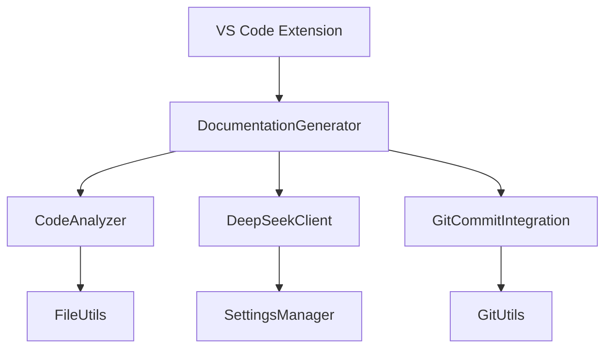
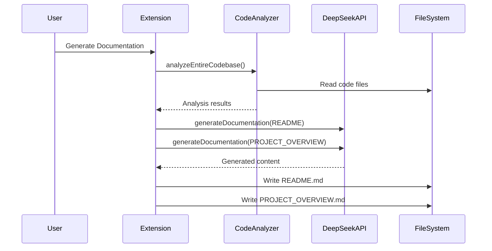
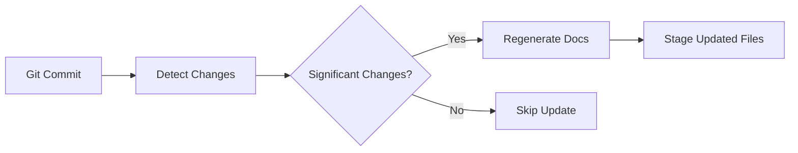

# PROJECT_OVERVIEW.md - Technical Documentation

## Table of Contents
1. [System Architecture](#system-architecture)
2. [Core Components](#core-components)
3. [API Reference](#api-reference)
4. [Configuration Options](#configuration-options)
5. [Workflows & Data Flow](#workflows--data-flow)
6. [Error Handling](#error-handling)
7. [Performance Characteristics](#performance-characteristics)
8. [Technical Specifications](#technical-specifications)
9. [Code Examples](#code-examples)

---

## System Architecture

### Overview
The documentation generator follows a modular architecture with three primary layers:

```
[Presentation Layer] 
    ↓
[Business Logic Layer] 
    ↓
[Data Access Layer]
```

### Component Diagram


### Design Patterns
1. **Facade Pattern**: `DocumentationGenerator` acts as facade for complex operations
2. **Observer Pattern**: Git watchers monitor repository changes
3. **Strategy Pattern**: Multiple analysis strategies for different file types
4. **Singleton Pattern**: `SettingsManager` and `EnvironmentManager`

---

## Core Components

### 1. DocumentationGenerator Class
**Responsibilities**:  
- Orchestrates documentation generation workflow
- Coordinates code analysis and AI integration

#### Methods
```typescript
class DocumentationGenerator {
  /**
   * Generates both README.md and PROJECT_OVERVIEW.md
   * @throws Error if API token not configured or workspace missing
   */
  async generateAllDocumentation(): Promise<void>

  /**
   * Analyzes entire codebase and returns concatenated content
   * @param workspacePath - Root directory of the project
   * @returns String containing analyzed code content
   */
  private async analyzeEntireCodebase(workspacePath: string): Promise<string>

  /**
   * Retrieves all code files in workspace
   * @param workspacePath - Project root path
   * @param excludePatterns - Glob patterns to exclude
   * @returns Array of file paths
   */
  private async getAllCodeFiles(
    workspacePath: string,
    excludePatterns: string[]
  ): Promise<string[]>
}
```

### 2. CodeAnalyzer Class
**Responsibilities**:  
- Static code analysis across multiple languages
- Extraction of code elements and metadata

#### Key Features
- Supports 11+ languages (TypeScript, Python, Java, etc.)
- AST-based analysis for TypeScript/JavaScript
- Regex-based fallback for other languages
- Complexity calculation using cyclomatic complexity

### 3. DeepSeekClient Class
**Responsibilities**:  
- Communication with DeepSeek R1T2 Chimera API
- Prompt engineering for documentation generation

#### Methods
```typescript
class DeepSeekClient {
  /**
   * Generates documentation content using AI
   * @param prompt - Customized prompt for documentation type
   * @param codeContext - Full codebase analysis
   * @returns Generated documentation content
   * @throws Error if API call fails
   */
  async generateDocumentation(
    prompt: string,
    codeContext: string
  ): Promise<string>
}
```

### 4. GitCommitIntegration Class
**Responsibilities**:  
- Automatic documentation updates on git commits
- Change detection and smart update triggering

#### Lifecycle Hooks
1. `pre-commit`: Checks for documentation updates
2. `post-commit`: Triggers regeneration if needed
3. `post-merge`: Handles merge scenarios

---

## API Reference

### SettingsManager API

#### Methods
```typescript
class SettingsManager {
  /** Retrieve API token from persistent storage */
  static getApiToken(): string | undefined
  
  /** Validate token against DeepSeek API */
  static async validateToken(token: string): Promise<boolean>
  
  /** Get file exclusion patterns */
  static getExcludePatterns(): string[]
}
```

### FileUtils API

#### Key Methods
```typescript
class FileUtils {
  /** Recursive directory scanner with pattern matching */
  async findFiles(
    rootPath: string,
    pattern: RegExp | string,
    options?: {
      recursive?: boolean
      includeDirectories?: boolean
      maxDepth?: number
    }
  ): Promise<string[]>

  /** Secure file operations with checksum verification */
  async writeFile(filePath: string, content: string): Promise<void>
}
```

---

## Configuration Options

### VS Code Settings (settings.json)
```json
{
  "ai-doc-generator.apiToken": "sk-...",
  "ai-doc-generator.autoUpdateOnCommit": true,
  "ai-doc-generator.excludePatterns": [
    "node_modules/**",
    "dist/**",
    "*.test.*"
  ],
  "ai-doc-generator.ai.defaultModel": "tngtech/deepseek-r1t2-chimera:free",
  "ai-doc-generator.ai.maxTokens": 8192,
  "ai-doc-generator.ai.temperature": 0.1
}
```

### Environment Variables
```bash
OPENROUTER_API_KEY=sk-or-...
```

---

## Workflows & Data Flow

### Documentation Generation Workflow


### Git Integration Workflow


---

## Error Handling

### Error Types and Recovery Strategies

| Error Type | Handling Strategy | Recovery Action |
|------------|-------------------|-----------------|
| API Connection Failure | Exponential backoff retry | Validate token, show configuration prompt |
| File System Errors | Graceful degradation | Skip problematic files, continue analysis |
| Code Parsing Errors | Fallback to regex parsing | Log warning, partial analysis |
| Git Integration Failures | Automatic disable | Notify user, maintain core functionality |

### Monitoring
- Console logging with error codes
- VS Code status bar notifications
- Error telemetry (opt-in)

---

## Performance Characteristics

### Metrics
| Operation | Average Time | Complexity |
|-----------|--------------|------------|
| Codebase Analysis (10k LOC) | 8-12s | O(n) |
| AI Documentation Generation | 15-30s | O(1) API call |
| Git Change Detection | <1s | O(1) file watcher |

### Optimization Strategies
1. **Selective Analysis**: Only analyze changed files for updates
2. **Caching**: AST caching for unchanged files
3. **Parallel Processing**: Concurrent file analysis
4. **Debouncing**: Git watcher events debounced at 1.5s

### Limitations
- Maximum file size: 2MB (API limit)
- Maximum context length: 16k tokens
- Supported languages: 11 primary languages

---

## Technical Specifications

### Requirements
- Node.js ≥18.x
- VS Code ≥1.85
- Git ≥2.25 (for auto-update features)

### Dependencies
```json
{
  "dependencies": {
    "@types/vscode": "^1.85.0",
    "simple-git": "^3.19.0",
    "typescript": "^5.3.3"
  }
}
```

### Security Considerations
1. API tokens stored in VS Code secure storage
2. All network requests use HTTPS
3. Content sanitization for AI prompts
4. No persistent collection of code data

---

## Code Examples

### Initializing Documentation Generation
```typescript
const generator = new DocumentationGenerator();

// Manual trigger
vscode.commands.registerCommand('generate-docs', async () => {
  await generator.generateAllDocumentation();
});
```

### Customizing Analysis
```typescript
// Custom exclude patterns
SettingsManager.getExcludePatterns = () => [
  'node_modules/**',
  'dist/**',
  'custom_exclude/**'
];

// Custom AI parameters
SettingsManager.getAIConfig = () => ({
  model: 'tngtech/deepseek-r1t2-chimera:free',
  maxTokens: 4096,
  temperature: 0.3
});
```

### Handling Git Integration
```typescript
const gitIntegration = new GitCommitIntegration(generator);

// Manual trigger after commit
gitIntegration.manuallyTriggerUpdate();
```

### Extending Language Support
```typescript
// Add new file extensions
class CustomCodeAnalyzer extends CodeAnalyzer {
  private supportedExtensions = [
    ...super.supportedExtensions,
    '.scala',
    '.kt'
  ];
  
  analyzeSingleFile(filePath: string) {
    // Custom analysis logic
  }
}
```